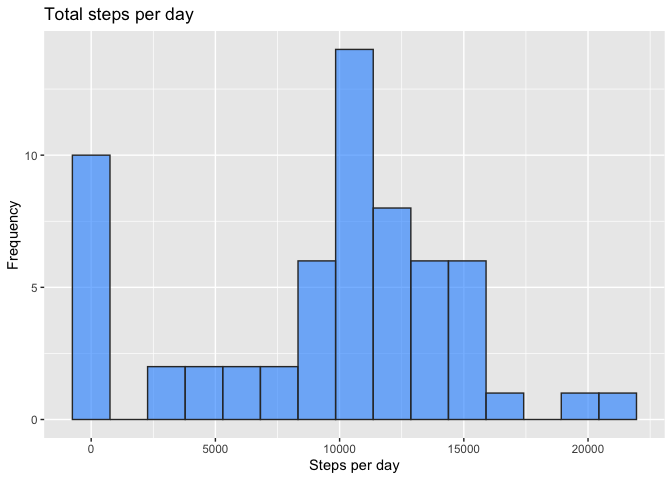
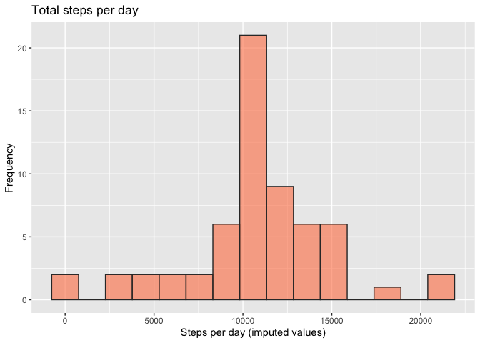
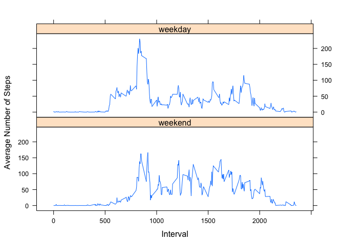

## Loading and preprocessing the data

```r
library(dplyr)
```

```
## 
## Attaching package: 'dplyr'
```

```
## The following objects are masked from 'package:stats':
## 
##     filter, lag
```

```
## The following objects are masked from 'package:base':
## 
##     intersect, setdiff, setequal, union
```

```r
library(ggplot2)
library(knitr)
library(lattice)

df<-read.csv("activity.csv", header = T)
```


## What is mean total number of steps taken per day?
Let's start by using `dplyr` to group the data by day, and then sum up the number of steps taken. We remove NA values from consideration in this round.

```r
steps_by_day<-df %>% group_by(date) %>%
    summarise(steps_per_day = sum(steps,na.rm = T), .groups = 'drop')
```

With our `steps_by_day` data frame, we can use ggplot to render a histogram of the total number of steps per day.

```r
ggplot(data =steps_by_day)+
    geom_histogram(aes(x = steps_per_day),
                   bins = 15, 
                   color='gray20',
                   fill = 'dodgerblue',
                   alpha = .6)+
    ylab("Frequency")+
    xlab("Steps per day")+
    ggtitle("Total steps per day")
```

<!-- -->

Next we compute and report the mean and median number of steps per day.

```r
mean_steps<-mean(steps_by_day$steps_per_day,
                 na.rm = T)
median_steps<-median(steps_by_day$steps_per_day,
                 na.rm = T)
```
The mean number of steps by day is 9354.2; the median value is 10395.

## What is the average daily activity pattern?
In this exploration, we will make time-series plot of the average steps grouped by the interval variable, which more or less tells us the time of day.

We first create a new data frame, `steps_by_interval`, that groups by the time interval and then takes the means for these groups.

```r
steps_by_interval<- df %>% 
    group_by(interval) %>%
    summarise(average_steps = mean(steps,na.rm = T), .groups = 'drop')
```

With this data frame, we can finish create our plot using ggplot:

```r
ggplot(data = steps_by_interval)+
    geom_line(aes(x = interval,
                  y = average_steps))+
    xlab("Time intervals (5-minute blocks)")+
    ylab("Mean number of steps per 5-minute interval")+
    ggtitle("Average steps by 5-minute intervals")+
    theme_bw()
```

<!-- -->

There appears to be a spike in the mean between interval 700 and 1000. What is that exactly? Let's take a look by using the `which.max()` function to extract the row where that interval occurs, and then print the interval value.

```r
row_max_average<-which.max(steps_by_interval$average_steps)
max_interval<-steps_by_interval[row_max_average,1]
```
The time interval with the maximum value for average steps is 835.

Since 835 indicates that 835 minutes has gone by since midnight, this is roughly 13.9 hours. Therefore, the largest average steps occurs somewhere around 2pm.

## Imputing missing values
There are many missing values in this data set.

```r
total_NA<-sum(is.na(df$steps))
pct_NA<-mean(is.na(df$steps))
```
There are 2304 missing values for the `steps` variable in the data frame, out of 17568 observations. This is about 13\% of the data.

We will impute the missing data by looking at the time interval for that record and then overwriting the NA-value with the average number of steps *for that time interal*. Let's prepare a second data frame, `df2` to hold our imputed data. (Recall that we have the data frame `steps_by_interval` already stored, so we can pull the average steps for each interval from that data frame.)

We begin by creating a copy of our original data frame, calling it `df2`, and then identify the rows with NA-values.

```r
df2<-df
NA_rows<-is.na(df2$steps)
```

To get the imputed values, which depend on the time interval, we write a small function in R. Using this function, we can use `sapply` to get a vector of imputed values to overwrite our NA-values in `df2`.  Notice the function below uses the `steps_by_interval` data frame to grab the appropriate mean based on an interval input.

```r
impute_mean_steps<-function(interval_val){
    steps_by_interval[steps_by_interval$interval==interval_val, 2]
}
```
Now we replace our NA-values with the appropriate means.

```r
df2[NA_rows,"steps"]<-as.numeric(sapply(df2[NA_rows,"interval"], impute_mean_steps))
```

In our next step, we want to revisit our histogram of total steps per day, as well as the mean and median computations, but now using `df2` with the imputed data.

As before, we create a summary data frame `steps_by_day2` that groups by the date and sums the steps for the day.

```r
steps_by_day2<-df2 %>% group_by(date) %>%
    summarise(steps_per_day = sum(steps), .groups = 'drop')
```

With our `steps_by_day2` data frame, we can use ggplot to render a histogram of the total number of steps per day.

```r
ggplot(data =steps_by_day2)+
    geom_histogram(aes(x = steps_per_day),
                   bins = 15, 
                   color='gray20',
                   fill = 'coral',
                   alpha = .6)+
    ylab("Frequency")+
    xlab("Steps per day (imputed values)")+
    ggtitle("Total steps per day")
```

<!-- -->

Notice that the frequency of days with 0 steps decreased between the two. The imputed values changed some of these means away from zero. For example, our first date 10/01 had only NAs and 0s as entries, but after imputation the NAs became non-zero values. 

Next we compute and report the mean and median number of steps per day.

```r
mean_steps2<-mean(steps_by_day2$steps_per_day)
median_steps2<-median(steps_by_day2$steps_per_day)
```
After imputation, the mean steps per day is 10766.2 and the median is 10766.2.


*Do these values differ from the estimates from the first part of the assignment?What is the impact of imputing missing data on the estimates of the total daily number of steps?*

These mean and median for the imputed data is definitely different from the same statistics for the original data. Both the mean and median values for the imputed data increase, with the biggest change happening for the mean. This can probably be explained by the fact the there are fewer days of 0 steps after the imputation process.


## Are there differences in activity patterns between weekdays and weekends?

We start by adding a new variable that extracts the weekday (Monday, Tuesday, et cetera) from the date variable. We first have to format the date variable as a Date, and then we apply the `weekdays()` function. We store this under the variable name `wday`.

```r
df2$wday<-weekdays(as.Date(df2$date,"%Y-%m-%d"))
```
Next we add one more variable,`day_type`, indicating whether this record corresponds to a day during the work week; i.e. Monday - Friday. The first line below creates a set of weekday names, and then we add the variable `day_type` by creating a logical vector and reformatting as a factor.  Finally, according to the specifications of the assignment, we reassign the levels of this factor variable to "weekday" and "weekend".

```r
work_week<-unique(df2$wday)[1:5]
df2$day_type<-as.factor(df2$wday %in% work_week)
levels(df2$day_type)<-c("weekend","weekday")
```

With this new variable `day_type` in the `df2` data frame, we prepare data for a time-series plot of mean steps per time interval but broken up by weekday or weekend activity. We start with a summarizing data frame:

```r
steps_dt_interval<- df2 %>% group_by(interval, day_type) %>%
    summarise(avg_steps = mean(steps), .groups = 'drop')
```

Now we pass these summaries to the `xyplot` function in the `lattice` package.

```r
xyplot(avg_steps ~ interval | day_type,
       data = steps_dt_interval,
       type = 'l',
       layout = c(1,2),
       ylab ="Average Number of Steps",
       xlab = "Interval")
```

<!-- -->
